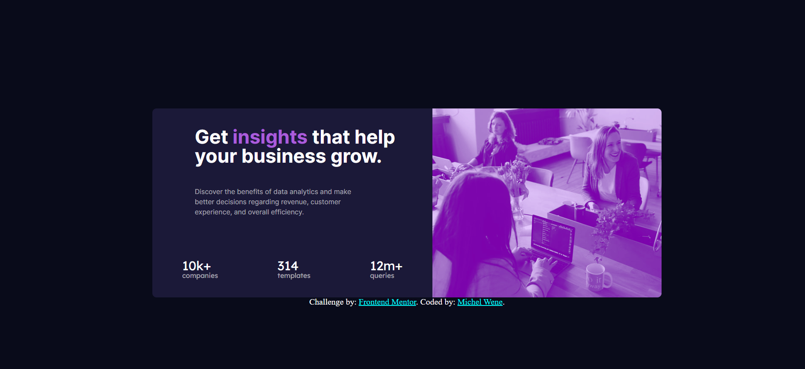

# Frontend Mentor - Stats preview card component

Esta é uma solução para o [Stats preview card component challenge on Frontend Mentor](https://www.frontendmentor.io/challenges/stats-preview-card-component-8JqbgoU62). Os desafios do Frontend Mentor ajudam você a melhorar suas habilidades de codificação ao construir projetos realistas.

## Resumo de conteúdos

- [Visão Geral](#Visão-Geral)
  - [O desafio](#O-desafio)
  - [Captura de tela](#Captura-de-tela)
  - [Links](#Links)
- [Meu processo](#Meu-processo)
  - [Construído com](#Constrído-com)
  - [O que eu aprendi](#O-que-eu-aprendi)
  - [Continuação dos desenvolvimentos](#Continuação-dos-desenvolvimentos)
  - [Recursos utilizados](#Recursos-utilizados)
- [Autor](#Autor)
- [Agradecimentos](#Agradecimentos)


## Visão Geral.

### O desafio

Os usuários devem ser capazes de:

- Veja estados de foco para elementos interativos.
- dois efeitos de fundo integrados.
- Criação de um cartão de informações.
- Observar um design responsivo.
### Captura de tela

- Desktop


- Mobile


### Links

- Solution URL: [https://github.com/michelwene/stats-preview-card](https://github.com/michelwene/stats-preview-card)
- Live Site URL: [https://michelwene.github.io/Order-Summary/](https://michelwene.github.io/Order-Summary/)

## Meu processo

### Construído com

- HTML5
- CSS3
- Flexbox
- Design responsivo
### O que eu aprendi

```html
<h1>Algum código HTML de que me orgulho</h1>
<main class="card">
      <section class="container">
        
        <section class="text">
          <h1 class="title">
            Get <strong class="insight"> insights</strong> that help your
            business grow.
          </h1>
          <p class="description">
            Discover the benefits of data analytics and make better decisions
            regarding revenue, customer experience, and overall efficiency.
          </p>
          <div class="info">
            <div>
              <h2 class="value">10k+</h2>
              <p class="value-description">companies</p>
            </div>
            <div>
              <h2 class="value">314</h2>
              <p class="value-description">templates</p>
            </div>
              <div>
                <h2 class="value">12m+</h2>
                <p class="value-description">queries</p>
              </div>
          </div>
        </section>
      </section>
    </main>
    <!--Me orgulho deste HTML pois entendi o real motivo da section e o da div, consegui compreender suas diferenças, e apliquei da melhor forma que consegui no HTML, desta forma consegui estruturar meu HTML, deixando tudo mais simples para o CSS.-->
```
```css
.Orgulho-deste-css {
  color: papayawhip;
}
.info{
    display: flex;
    justify-content: space-around;
    padding-top: 100px;
    text-align: left;
    font-family: 'Lexend Deca';
}
.info:hover{
    cursor: default;
}

.info div:hover{ /*Interessante ver a interação de uma classe "info" e uma "div" que é uma tag do HTML*/
    box-shadow: 20px 20px 10px black;
    border-radius: 70px;
    transform: translateY(-3px);
    box-shadow: 0 10px 20px rgba(0, 0, 0, 0.2);
}
/*Apliquei alguns efeitos de hover nas estatisticas do texto, deu um efeito muito legal no site.*/

footer a{
    color: aqua;
}
footer a:hover{
    color: red;
}

/*Novamente um efeito de mudança de cor, utilizando o hover*/


/*O que eu percebi também que a parte da responsividade mobile, ficou bem melhor que do projeto anterior "Order-Summary-component", a parte da responsividade respondeu melhor pois neste projeto, o HTML ficou bem melhor estruturado.
```

### Continuação dos desenvolvimentos


Pretendo continuar fazendo projetos do FrontendMentor, para melhorar meu HTML e CSS, e depois vou adicionar o JavaScript, completando o "Trio de ferro WEB"

### Recursos utilizados

- [CSS tricks](https://css-tricks.com/snippets/css/a-guide-to-flexbox/) - Este site me ajudou muito na parte de posicionamento dos elementos, pois a maior parte dos elementos foram posicionados utilizando flexbox.
- [W3schools](https://www.w3schools.com/css/default.asp) - Este site me ajuda muito nas minhas dúvidas sobre CSS e HTML
- [StackOverflow](https://stackoverflow.com/) - Primeiro projeto em que utilizo este site, estava com muita dúvida na questão de colocar uma cor na imagem.


## Autor

- Frontend Mentor - [@michelwene](https://www.frontendmentor.io/profile/michelwene)
- Linkedin - [@michelwene](https://www.linkedin.com/in/michelwene/)


## Agradecimentos

Quero agradecer às seguintes pessoas que responderam algumas perguntas e me ajudaram a terminar este projeto.
- [@JCDMeira](https://github.com/JCDMeira)
- [@GH110602](https://github.com/GH110602)

